# Laser Tracker Threaded HSM - Hierarchical State Machine Demo

A C++17 implementation demonstrating the **Hierarchical State Machine (HSM)** pattern using `std::variant` for type-safe state representation. The HSM runs in a **dedicated worker thread**, providing **galvanic separation** between the main/UI thread and the state machine engine.

## Overview

This project showcases modern C++ patterns for implementing complex state machines with:

- **Hierarchical (nested) states** using `std::variant`
- **Type-safe event/command handling** with `std::visit`
- **State entry/exit actions** for resource management
- **Composite states** containing sub-states
- **Event-driven and command-driven transitions** with proper action handling
- **Dedicated worker thread** for the HSM engine
- **Galvanic separation** between UI and worker threads
- **Events** (past-tense notifications: "what happened")
- **Commands** (imperative instructions: "what to do")
- **JSON message protocol** for inter-thread communication
- **Synchronous/asynchronous execution** with timeout support

## Events vs Commands

The HSM distinguishes between two types of messages based on semantic meaning:

### Events (Past Tense - "What Happened")
Events represent external occurrences. The FSM doesn't control these; it simply reacts to them.

| Event | Parameters | Description |
|-------|------------|-------------|
| `InitComplete` | - | Initialization completed successfully |
| `InitFailed` | errorReason | Initialization failed with error |
| `TargetFound` | distance_mm | Target retroreflector was found |
| `TargetLost` | - | Target was lost during tracking |
| `MeasurementComplete` | x, y, z | A measurement point was recorded |
| `ErrorOccurred` | errorCode, description | An error occurred in the system |

### Commands (Imperative - "What to Do")
Commands are instructions sent to the FSM to drive specific outcomes.

**State-Changing Commands:**

| Command | Sync | Expected State | Description |
|---------|------|----------------|-------------|
| `PowerOn` | Yes | `Idle` | Waits until InitComplete event (blocks until system is ready) |
| `PowerOff` | No | `Off` | Immediate transition to Off |
| `StartSearch` | Yes | `Locked` | Waits until TargetFound event (blocks until target acquired) |
| `StartMeasure` | No | `Measuring` | Immediate transition to Measuring |
| `StopMeasure` | No | `Locked` | Immediate transition to Locked |
| `Reset` | Yes | `Idle` | Waits until InitComplete event (blocks during reset) |
| `ReturnToIdle` | No | `Idle` | Immediate transition to Idle |

**Expected State Behavior:** Commands with `expectedState` don't return until that state is reached (or timeout). For example, `StartSearch` returns only after `TargetFound` event transitions the system to `Locked` state. This ensures the caller knows the operation completed successfully.

**Action Commands (don't change state, may be state-restricted):**

| Command | Valid States | Sync | Description |
|---------|--------------|------|-------------|
| `Home` | Idle | Yes | Move to home position |
| `GetPosition` | Idle, Locked, Measuring | No | Get current position |
| `SetLaserPower` | Any Operational | No | Adjust laser power (0.0-1.0) |
| `Compensate` | Idle, Locked | Yes | Apply environmental compensation |
| `GetStatus` | Any | No | Get system status |
| `MoveRelative` | Idle, Locked | Yes | Relative movement by azimuth/elevation |

## State Hierarchy

The Laser Tracker HSM implements a multi-level state hierarchy:

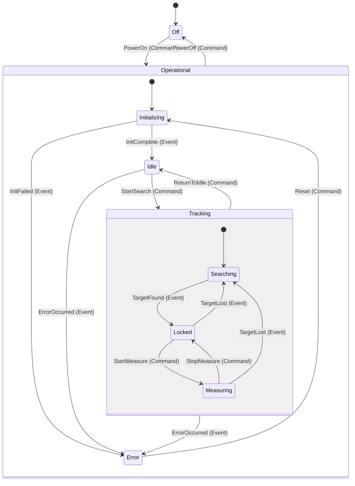

## Message Flow


## Architecture

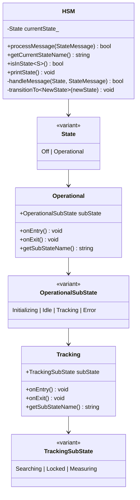

## Threaded Architecture

The `ThreadedHSM` class provides complete galvanic separation between the UI/main thread and the HSM worker thread:

### Features

- **Dedicated Worker Thread**: HSM runs in its own thread ("LaserTracker HSM Worker"), processing messages from a queue
- **Thread-Safe State Access**: Query state safely from any thread
- **Message-Based Communication**: Events and commands sent via thread-safe queue
- **Synchronous & Asynchronous**: Choose blocking or fire-and-forget message sending
- **Timeout Support**: Configurable timeouts prevent indefinite blocking
- **Message Buffering**: Messages queued during sync operations
- **Debugger-Friendly**: Worker thread is named for easy identification in Visual Studio/debuggers

### JSON Message Protocol

Messages use a unified JSON format for both requests and responses. Each message includes a **timestamp** (created automatically using `std::chrono::steady_clock`) for tracking message age and timeout handling.

**Request Format:**
```json
{
  "id": 1,
  "name": "Home",
  "params": { "speed": 100.0 },
  "sync": true,
  "timeoutMs": 5000,
  "timestampMs": 0
}
```

**Response Format:**
```json
{
  "id": 1,
  "isResponse": true,
  "success": true,
  "result": { "position": { "azimuth": 0.0, "elevation": 0.0 } },
  "error": null,
  "timestampMs": 42
}
```

**Message Timing Features:**
- `timestampMs`: Age of message in milliseconds (time since creation)
- `timeoutMs`: Maximum wait time for response (0 = no timeout)
- `isTimedOut()`: Check if message exceeded its timeout
- `remainingTime()`: Get time left before timeout
- `ageMs()`: Get current age of message

### Usage Example

```cpp
#include "ThreadedHSM.hpp"
using namespace LaserTracker;

ThreadedHSM tracker;
tracker.start();

// Send message async (fire and forget)
tracker.sendMessageAsync(Commands::PowerOn{});

// Send message sync and wait for response
auto response = tracker.sendMessage(Events::InitComplete{});

// Same API for Commands and Events - unified interface
tracker.sendMessage(Commands::StartSearch{});
tracker.sendMessage(Events::TargetFound{5000.0});

// Action commands work the same way
auto result = tracker.sendMessage(Commands::Home{50.0});
if (result.success)
{
    std::cout << "Home complete: " << result.params.dump() << "\n";
}

tracker.stop();
```

The API is unified - `sendMessage()` and `sendMessageAsync()` work for both Events and Commands. The namespace distinction (`Events::` vs `Commands::`) provides semantic clarity while the processing is uniform.

## Message Processing & Results

This section explains how different message types are processed and how results are returned to the caller.

### Message Categories

Messages fall into three categories based on how they affect state and return results:

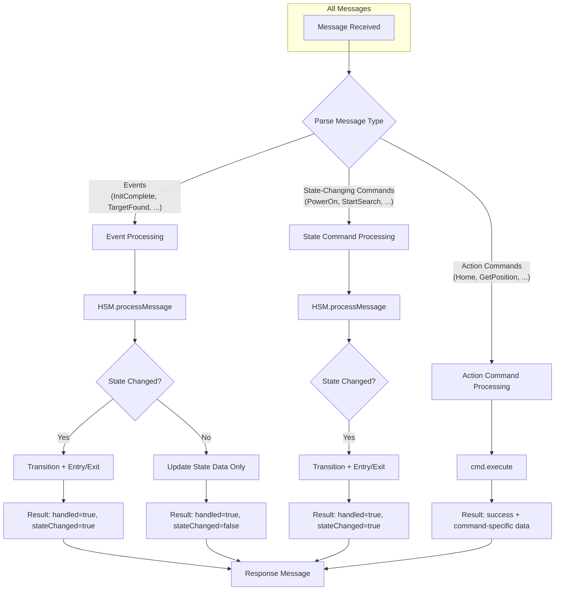

### Events: State-Changing vs Data-Only

Not all events trigger state transitions. Some events update internal state data without changing the current state:

| Event | Effect | State Change? |
|-------|--------|---------------|
| `InitComplete` | Initializing → Idle | Yes |
| `InitFailed` | Initializing → Error | Yes |
| `TargetFound` | Searching → Locked | Yes |
| `TargetLost` | Locked/Measuring → Searching | Yes |
| `ErrorOccurred` | Any → Error | Yes |
| `MeasurementComplete` | Records point, stays in Measuring | **No** |

The `MeasurementComplete` event is an example of a **data event** - it's handled by the HSM but only updates internal data (the measurement count and coordinates) without transitioning to a different state.

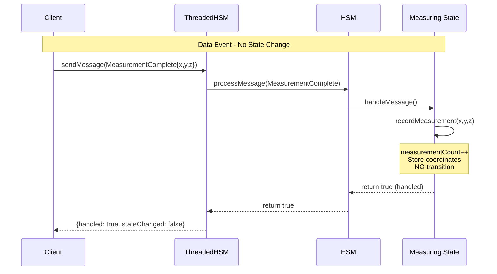

### Synchronous vs Asynchronous Message Handling

The HSM supports two modes of sending messages:

#### Asynchronous (Fire-and-Forget)

```cpp
uint64_t id = tracker.sendMessageAsync(Events::TargetFound{5000.0});
// Returns immediately, message processed in background
// No response available
```

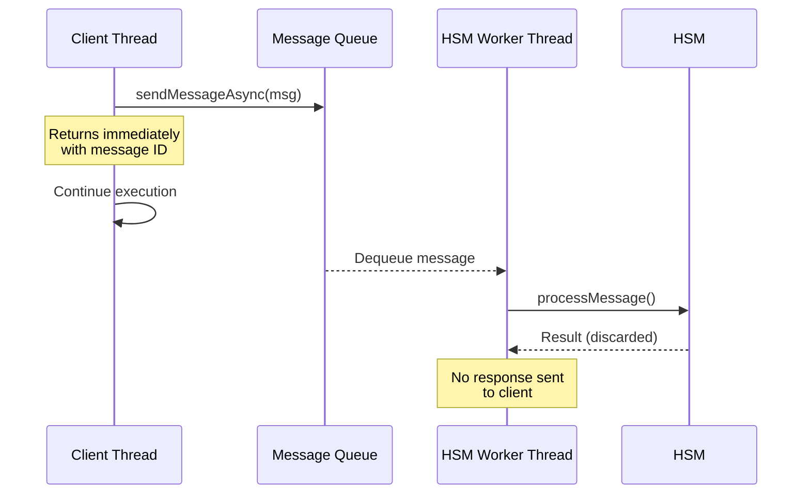

**Use cases:**
- Notifications that don't need confirmation
- High-frequency events where latency matters
- Events where the caller doesn't care about the result

#### Synchronous (Wait for Response)

```cpp
Message response = tracker.sendMessage(Commands::Home{50.0});
// Blocks until HSM processes and returns result
if (response.success) {
    std::cout << "Position: " << response.params.dump() << "\n";
}
```

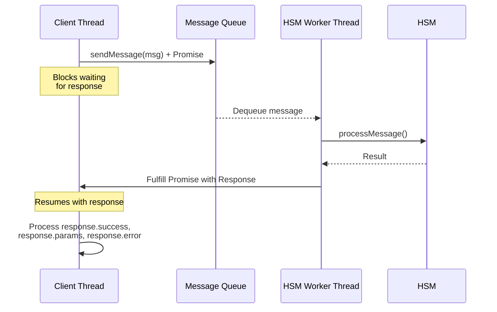

#### How Futures and Promises Work

The synchronous message pattern uses C++ `std::promise` and `std::future` to safely pass results between threads. This is a **one-time, one-way communication channel**:

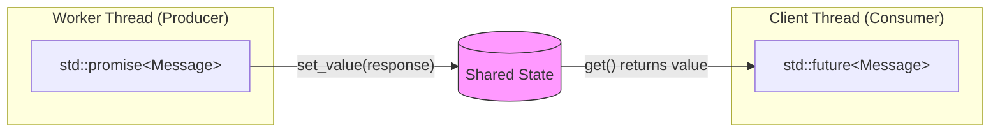

**The Promise/Future Contract:**

| Component | Thread | Role |
|-----------|--------|------|
| `std::promise<Message>` | Worker | Producer - will provide a value later |
| `std::future<Message>` | Client | Consumer - will receive the value when ready |
| Shared State | Internal | Thread-safe storage connecting promise to future |

**Step-by-step flow in ThreadedHSM:**

```cpp
// 1. Client thread creates promise and extracts future
Message sendAndWait(Message msg)
{
    std::promise<Message> promise;
    auto future = promise.get_future();  // Connected to promise

    uint64_t id = msg.id;

    // 2. Store promise in map so worker can find it
    {
        std::lock_guard<std::mutex> lock(promiseMutex_);
        pendingPromises_[id] = std::move(promise);
    }

    // 3. Push message to queue
    messageQueue_.push(std::move(msg));

    // 4. Block until worker fulfills promise (or timeout)
    auto status = future.wait_for(std::chrono::milliseconds(timeoutMs));

    if (status == std::future_status::ready)
    {
        return future.get();  // Returns the response
    }
    else
    {
        return Message::createTimeoutResponse(id);
    }
}
```

```cpp
// Worker thread - after processing message
void processMessage(PendingMessage pending)
{
    // ... process the message ...
    Message response = processMessageContent(msg);

    // 5. Find and fulfill the promise
    {
        std::lock_guard<std::mutex> lock(promiseMutex_);
        auto it = pendingPromises_.find(msg.id);
        if (it != pendingPromises_.end())
        {
            it->second.set_value(response);  // Unblocks client!
            pendingPromises_.erase(it);
        }
    }
}
```

```mermaid
sequenceDiagram
    participant Client as Client Thread
    participant Map as pendingPromises_
    participant Queue as Message Queue
    participant Worker as Worker Thread

    Note over Client: Create promise/future pair
    Client->>Client: promise = std::promise&lt;Message&gt;()
    Client->>Client: future = promise.get_future()

    Client->>Map: Store promise by message ID
    Client->>Queue: Push message

    Note over Client: future.wait_for(timeout)
    Note over Client: Thread BLOCKED

    Queue-->>Worker: Pop message
    Worker->>Worker: Process message
    Worker->>Worker: Create response

    Worker->>Map: Find promise by ID
    Map-->>Worker: promise reference
    Worker->>Worker: promise.set_value(response)

    Note over Client: future becomes ready
    Note over Client: Thread UNBLOCKED

    Client->>Client: response = future.get()
```

**Key Properties of Promise/Future:**

| Property | Behavior |
|----------|----------|
| One-shot | Can only set value once; second `set_value()` throws exception |
| Thread-safe | Safe to call `set_value()` and `get()` from different threads |
| Blocking | `future.get()` blocks until value is available |
| Timeout support | `future.wait_for()` returns status without blocking forever |
| Move-only | Promises and futures cannot be copied, only moved |

**Why use Promise/Future instead of alternatives?**

| Alternative | Problem |
|-------------|---------|
| Polling a shared variable | Wastes CPU, requires manual synchronization |
| Condition variable | More complex setup, easy to get wrong |
| Callback | Callback runs on worker thread, not client thread |
| **Promise/Future** | Clean API, automatic synchronization, timeout support |

#### Pending Promises Management

The `pendingPromises_` map tracks all outstanding synchronous requests, enabling the worker thread to find and fulfill the correct promise when a response is ready.

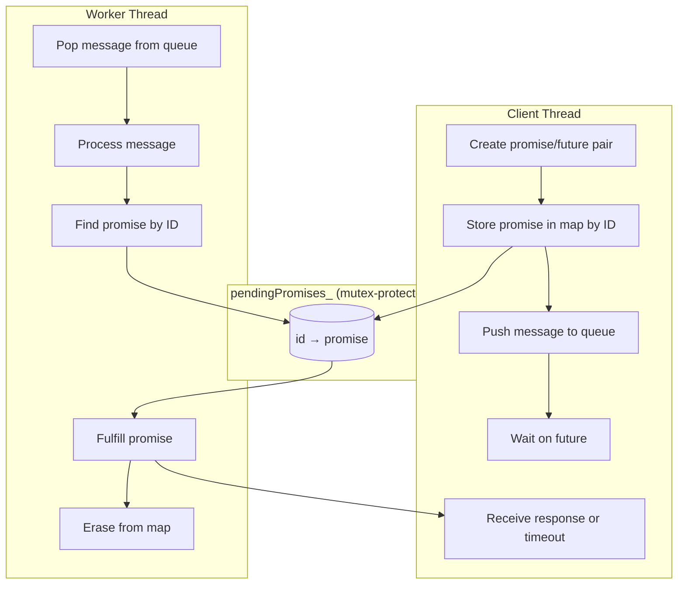

**Lifecycle of a Pending Promise:**

| Step | Thread | Action | Map State |
|------|--------|--------|-----------|
| 1 | Client | `promise` created, `future` extracted | - |
| 2 | Client | `pendingPromises_[id] = std::move(promise)` | `{id: promise}` |
| 3 | Client | Message pushed to queue | `{id: promise}` |
| 4 | Client | `future.wait_for(timeout)` blocks | `{id: promise}` |
| 5 | Worker | Message popped and processed | `{id: promise}` |
| 6 | Worker | `promise.set_value(response)` | `{id: promise}` |
| 7 | Worker | `pendingPromises_.erase(id)` | `{}` |
| 8 | Client | `future.get()` returns response | `{}` |

**Timeout Handling:**

When a client times out waiting for a response, cleanup is required to prevent resource leaks:

```cpp
// Client side - timeout occurred
auto status = future.wait_for(std::chrono::milliseconds(timeoutMs));
if (status != std::future_status::ready)
{
    // Timeout! Remove the orphaned promise
    {
        std::lock_guard<std::mutex> lock(promiseMutex_);
        pendingPromises_.erase(id);  // Promise will never be fulfilled
    }
    return Message::createTimeoutResponse(id);
}
```

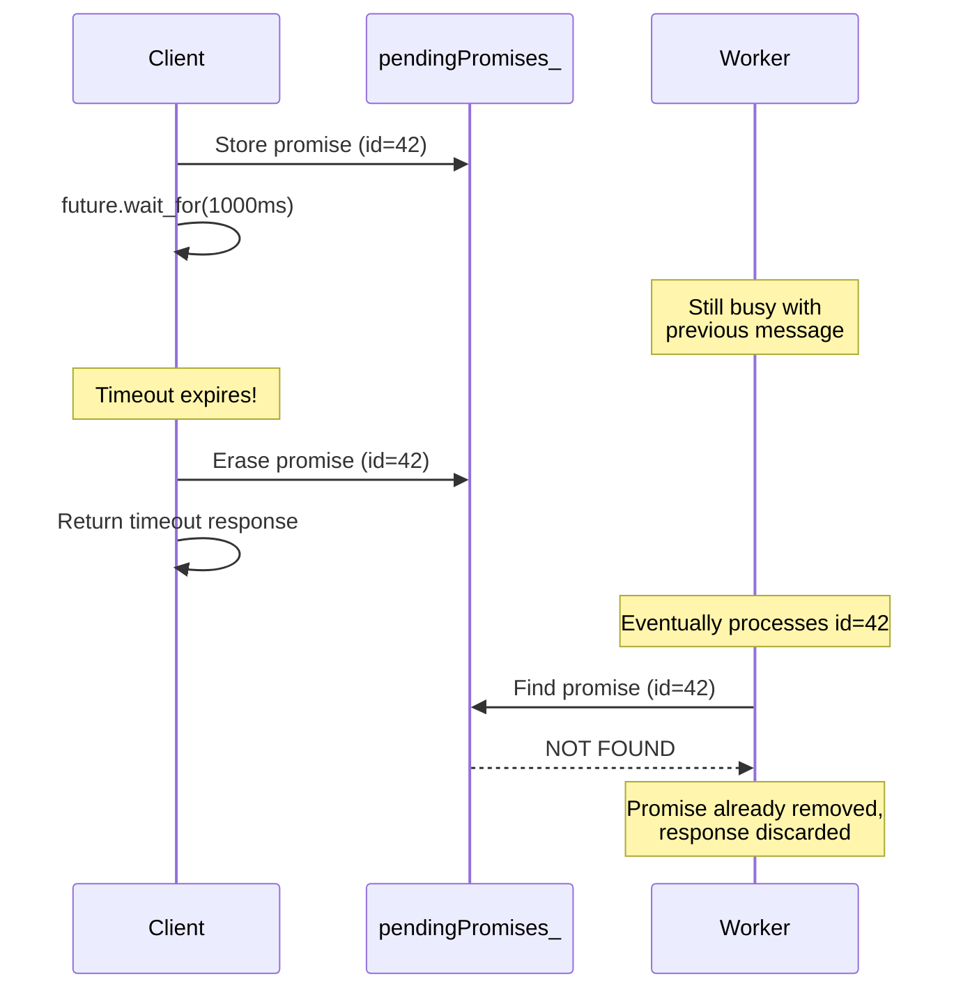

**Thread Safety:**

The `pendingPromises_` map is protected by `promiseMutex_`:

```cpp
// All accesses are mutex-protected
std::unordered_map<uint64_t, std::promise<Message>> pendingPromises_;
std::mutex promiseMutex_;

// Client thread - storing promise
{
    std::lock_guard<std::mutex> lock(promiseMutex_);
    pendingPromises_[id] = std::move(promise);
}

// Worker thread - fulfilling promise
{
    std::lock_guard<std::mutex> lock(promiseMutex_);
    auto it = pendingPromises_.find(msg.id);
    if (it != pendingPromises_.end())
    {
        it->second.set_value(response);
        pendingPromises_.erase(it);
    }
}
```

**Edge Cases Handled:**

| Scenario | Handling |
|----------|----------|
| Message processed before timeout | Promise fulfilled, client receives response |
| Timeout before processing | Promise removed by client, worker discards response |
| Worker finds no promise | Response discarded (async message or already timed out) |
| Multiple clients, same ID | IDs are unique (`nextMessageId_++`), never collides |

### The `sync` Flag: Blocking Other Messages

The `sync` flag on action commands has a specific meaning: **the HSM should not process other messages until this command completes**.

This is important for commands that take time to execute (like `Home` or `Compensate`) where interleaving other commands could cause issues.

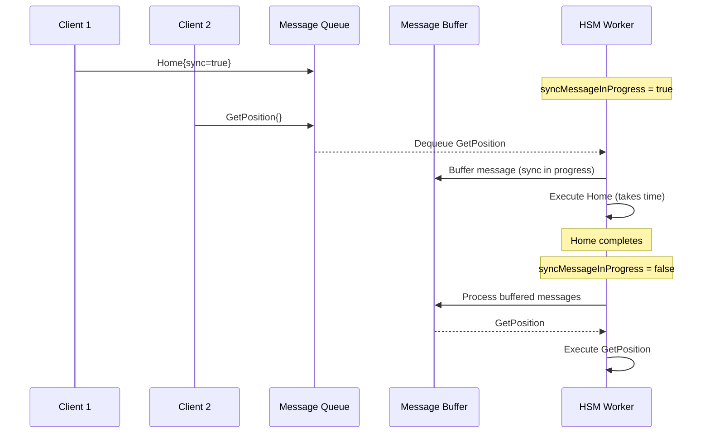

### Result Structure by Message Type

Each message type returns different result data:

#### Events and State-Changing Commands

```json
{
  "id": 1,
  "isResponse": true,
  "success": true,
  "result": {
    "handled": true,
    "state": "Operational::Tracking::Locked",
    "stateChanged": true
  }
}
```

#### Action Commands

```json
{
  "id": 2,
  "isResponse": true,
  "success": true,
  "result": {
    "position": {
      "x": 1234.567,
      "y": 2345.678,
      "z": 345.789,
      "azimuth": 45.123,
      "elevation": 12.456
    }
  }
}
```

#### Failed Commands (State Restriction)

```json
{
  "id": 3,
  "isResponse": true,
  "success": false,
  "result": {},
  "error": "Home command only valid in Idle state (current: Operational::Tracking::Locked)"
}
```

### Complete Message Flow

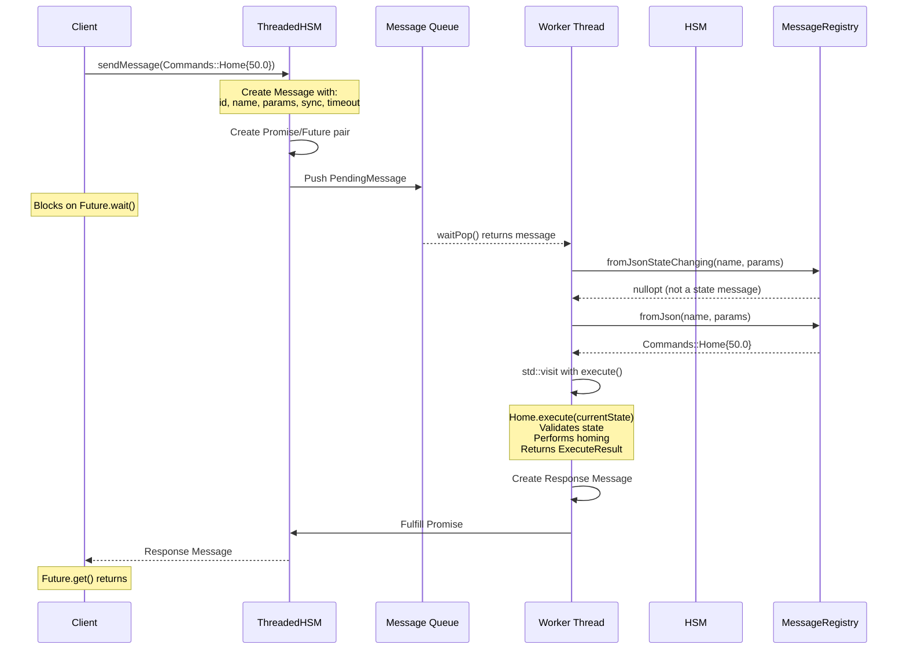

### Timeout Handling

Messages can specify a timeout. If the HSM doesn't process the message in time, the caller receives a timeout response:

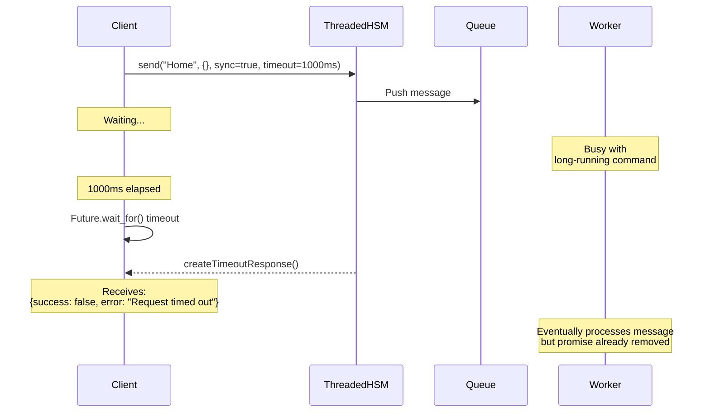

### Expected State: Waiting for State Transitions

State-changing commands can specify an `expectedState` that the system should reach before the command returns. This is useful for operations that require external events to complete:

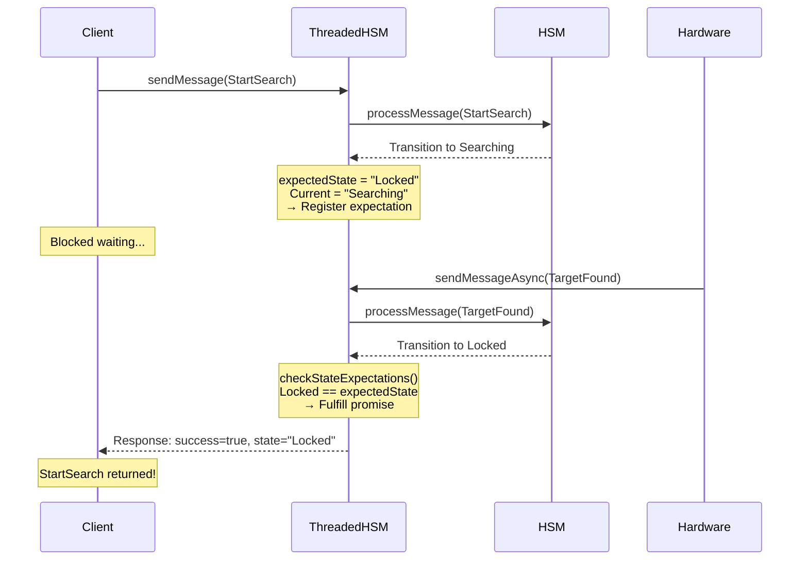

**Commands with Expected State:**

| Command | Immediate State | Expected State | Waits For |
|---------|-----------------|----------------|-----------|
| `PowerOn` | Initializing | Idle | `InitComplete` event |
| `StartSearch` | Searching | Locked | `TargetFound` event |
| `Reset` | Initializing | Idle | `InitComplete` event |
| `PowerOff` | Off | Off | (immediate) |
| `StartMeasure` | Measuring | Measuring | (immediate) |
| `StopMeasure` | Locked | Locked | (immediate) |
| `ReturnToIdle` | Idle | Idle | (immediate) |

**Timeout Behavior:** If the expected state is not reached within the message timeout (default 30 seconds), the command returns with `success=false` and an error message.

### Summary: When to Use Each Pattern

| Pattern | Use When | Example |
|---------|----------|---------|
| `sendMessageAsync()` | Don't need response, fire-and-forget | Sending periodic `MeasurementComplete` events |
| `sendMessage()` with `sync=false` | Need response but command is fast | `GetPosition`, `GetStatus` |
| `sendMessage()` with `sync=true` | Need response AND command takes time | `Home`, `Compensate` |
| Timeout | Protecting against HSM hangs | Any synchronous call in production |

## C++ Programming Patterns Used

### 1. Type-Safe State Representation with `std::variant`

```cpp
// Top-level state variant
using State = std::variant<States::Off, States::Operational>;

// Nested state variants for hierarchy
using OperationalSubState = std::variant<Initializing, Idle, Tracking, Error>;
using TrackingSubState = std::variant<Searching, Locked, Measuring>;
```

**Benefits:**
- Compile-time type safety
- No virtual function overhead
- Exhaustive pattern matching with `std::visit`

### 2. Unified Message Dispatch with `std::visit`

```cpp
// Single flat variant for all message types
using StateMessage = std::variant<
    Events::InitComplete, Events::TargetFound, ...
    Commands::PowerOn, Commands::StartSearch, ...
>;

// Unified processing - no if/else needed
bool processMessage(const StateMessage& msg)
{
    return std::visit(
        [this, &msg](auto& state) -> bool
        {
            return this->handleMessage(state, msg);
        },
        currentState_);
}

// Uniform name extraction via operator()
std::string getMessageName(const StateMessage& msg)
{
    return std::visit([](const auto& m) { return m(); }, msg);
}
```

**Benefits:**
- Type-safe message routing
- Compiler enforces handling all state types
- Uniform API for Events and Commands
- No if/else dispatch logic needed

### 3. State Entry/Exit Actions

```cpp
struct Idle
{
    static constexpr const char* name = "Idle";

    void onEntry() const
    {
        std::cout << "  [ENTRY] Idle: Ready for operation\n";
    }

    void onExit() const
    {
        std::cout << "  [EXIT] Idle: Activating systems\n";
    }
};
```

**Benefits:**
- Resource acquisition/release at state boundaries
- Clear lifecycle management
- Debuggable state transitions

### 4. Composite State Pattern

```cpp
struct Tracking
{
    TrackingSubState subState;

    void onEntry() const
    {
        std::cout << "  [ENTRY] Tracking\n";
        std::visit([](const auto& s) { s.onEntry(); }, subState);
    }

    void onExit() const
    {
        std::visit([](const auto& s) { s.onExit(); }, subState);
        std::cout << "  [EXIT] Tracking\n";
    }
};
```

**Benefits:**
- Encapsulates sub-state behavior
- Proper entry/exit ordering
- Hierarchical event handling

### 5. constexpr Static Members

```cpp
struct Searching
{
    static constexpr const char* name = "Searching";
    // ...
};
```

**Benefits:**
- Zero runtime overhead for state names
- Compile-time string constants
- Enables template metaprogramming

### 6. SFINAE/if constexpr for Type Dispatch

```cpp
return std::visit(
    [](const auto& s) -> std::string
    {
        using T = std::decay_t<decltype(s)>;
        if constexpr (std::is_same_v<T, Tracking>)
        {
            return std::string(s.name) + "::" + s.getSubStateName();
        }
        else
        {
            return s.name;
        }
    },
    subState);
```

**Benefits:**
- Compile-time type selection
- No runtime branching overhead
- Type-specific code paths

### 7. nlohmann/json ADL Serialization

Each Event and Command has `to_json`/`from_json` friend functions for automatic JSON conversion:

```cpp
struct TargetFound
{
    static constexpr const char* name = "TargetFound";
    double distance_mm = 0.0;

    friend void to_json(nlohmann::json& j, const TargetFound& e)
    {
        j = nlohmann::json{{"distance_mm", e.distance_mm}};
    }

    friend void from_json(const nlohmann::json& j, TargetFound& e)
    {
        if (j.contains("distance_mm"))
            j.at("distance_mm").get_to(e.distance_mm);
    }
};
```

**Benefits:**
- Automatic serialization via ADL (Argument-Dependent Lookup)
- Type-safe JSON conversion
- Consistent with nlohmann/json conventions

### 8. Compile-Time Type Registry with Fold Expressions

The `MessageRegistry` template maps JSON message names to C++ types at compile time:

```cpp
template <typename... Types>
struct MessageRegistry
{
    using Variant = std::variant<Types...>;

    // JSON name → variant: uses fold expression to find matching type
    static std::optional<Variant> fromJson(const std::string& name, const Json& params)
    {
        std::optional<Variant> result;
        (tryParseType<Types>(name, params, result) || ...);  // Fold expression
        return result;
    }

    // Same as fromJson, but excludes action commands (those with static `sync` member)
    static std::optional<Variant> fromJsonStateChanging(const std::string& name, const Json& params)
    {
        std::optional<Variant> result;
        (tryParseTypeExcludeActions<Types>(name, params, result) || ...);
        return result;
    }

    // variant → JSON: uses std::visit with to_json ADL
    static Json toJson(const Variant& msg)
    {
        return std::visit([](const auto& m) -> Json { return m; }, msg);
    }
};

// Single registry for all message types
using StateMessageRegistry = MessageRegistry<Events::..., Commands::...>;
```

**Benefits:**
- No manual if-else chains for JSON parsing
- Adding new message types is automatic (just include in variant)
- Compile-time type safety with runtime name lookup
- Action commands filtered using existing `has_sync` trait (no separate registry needed)
- `std::visit` handles dispatch after variant construction

### 9. Self-Executing Commands with execute() Member

Action commands have an `execute()` method that encapsulates their logic:

```cpp
struct Home
{
    static constexpr const char* name = "Home";
    static constexpr bool sync = true;
    double speed = 100.0;

    ExecuteResult execute(const std::string& currentState) const
    {
        if (currentState.find("Idle") == std::string::npos)
        {
            return ExecuteResult::fail("Home only valid in Idle state");
        }
        // ... perform homing ...
        return ExecuteResult::ok({{"position", {{"azimuth", 0.0}, {"elevation", 0.0}}}});
    }
};
```

The dispatcher uses `std::visit` to call the appropriate `execute()` method:

```cpp
Message processActionCommand(const Message& msg)
{
    auto actionCmd = StateMessageRegistry::fromJson(msg.name, msg.params);
    return std::visit(
        [&](const auto& cmd) -> Message
        {
            using T = std::decay_t<decltype(cmd)>;
            if constexpr (has_sync<T>::value)  // Action commands have sync member
            {
                ExecuteResult result = cmd.execute(currentState);
                return Message::createResponse(msg.id, result.success, result.params, result.error);
            }
            // ...
        },
        *actionCmd);
}
```

**Benefits:**
- Each command is self-contained (name, params, validation, execution logic)
- Adding a new command = implement one struct with `execute()`
- No if-else chains in dispatcher
- Type-safe dispatch via `std::visit`

## Building the Project

### Requirements

- C++17 compatible compiler (GCC 7+, Clang 5+, MSVC 2017+)
- CMake 3.14+

### Build Instructions

```bash
# Create build directory
mkdir build && cd build

# Configure
cmake ..

# Build
cmake --build .

# Run
./bin/laser_tracker_hsm
```

### Alternative: Direct Compilation

```bash
g++ -std=c++17 -pthread -o laser_tracker_hsm main.cpp
```

## Usage

### Command Line Options

```bash
./laser_tracker_hsm --help          # Show help
./laser_tracker_hsm --all           # Run all demos
./laser_tracker_hsm --interactive   # Interactive mode
./laser_tracker_hsm                  # Show menu
```

### Interactive Mode Commands

**Commands (Imperative - "What to Do"):**

| Command | Description |
|---------|-------------|
| `power_on` | Turn on the laser tracker |
| `power_off` | Turn off the laser tracker |
| `search` | Start searching for target |
| `measure` | Start measuring |
| `stop` | Stop measuring |
| `idle` | Return to idle state |
| `reset` | Reset from error state |
| `home [speed]` | Move to home position (Idle only) |
| `getpos` | Get current position |
| `power <0-1>` | Set laser power level |
| `compensate <temp> <pressure> <humidity>` | Apply environmental compensation |
| `status` | Get system status |
| `move <az> <el>` | Move relative by azimuth/elevation |

**Events (Past Tense - "What Happened"):**

| Command | Description |
|---------|-------------|
| `init_ok` | Initialization completed |
| `init_fail` | Initialization failed |
| `found <dist>` | Target was found at distance (mm) |
| `lost` | Target was lost |
| `point <x> <y> <z>` | Measurement point was recorded |
| `error <code>` | An error occurred |

**Utilities:**

| Command | Description |
|---------|-------------|
| `state` | Print current state |
| `help` | Show help |
| `quit` | Exit interactive mode |

### Demo Scenarios

1. **Threaded HSM Basic Operation** - Async/sync command and event sending to worker thread
2. **Commands with State Restrictions** - Command validation and execution
3. **Synchronous Command Buffering** - Message queuing during sync operations
4. **JSON Message Protocol** - Raw JSON message handling
5. **Multi-threaded Event Sending** - Multiple threads sending events to HSM
6. **Complete Workflow** - Full laser tracker workflow through all states

## State Transition Table

| Current State | Message | Type | Next State |
|---------------|---------|------|------------|
| Off | PowerOn | Command | Operational::Initializing |
| Operational::* | PowerOff | Command | Off |
| Initializing | InitComplete | Event | Idle |
| Initializing | InitFailed | Event | Error |
| Idle | StartSearch | Command | Tracking::Searching |
| Idle | ErrorOccurred | Event | Error |
| Tracking::* | ReturnToIdle | Command | Idle |
| Tracking::* | ErrorOccurred | Event | Error |
| Searching | TargetFound | Event | Locked |
| Locked | StartMeasure | Command | Measuring |
| Locked | TargetLost | Event | Searching |
| Measuring | MeasurementComplete | Event | Measuring (internal) |
| Measuring | StopMeasure | Command | Locked |
| Measuring | TargetLost | Event | Searching |
| Error | Reset | Command | Initializing |

## Project Structure

```
StateMachine/
├── CMakeLists.txt        # CMake build configuration
├── Keywords.hpp          # Compile-time string constants for JSON keys
├── ThreadedHSM.hpp       # Complete HSM with threading, events/commands & JSON messaging
├── main.cpp              # Demo application
├── tests/
│   ├── test_hsm.cpp           # HSM state transition tests
│   ├── test_threaded_hsm.cpp  # Threading and message passing tests
│   └── test_action_commands.cpp # Action command tests
├── .clang-format         # Code formatting configuration
├── CLAUDE.md             # Claude Code guidelines (includes README maintenance rules)
└── README.md             # This file (keep in sync with code!)
```

## Key Design Decisions

1. **Header-Only Implementation**: `ThreadedHSM.hpp` is header-only for easy integration
2. **Galvanic Separation**: Complete thread isolation between UI and HSM worker
3. **Value Semantics**: States are value types stored in variants, avoiding heap allocation
4. **Minimal Dependencies**: Uses C++ standard library plus [nlohmann/json](https://github.com/nlohmann/json) for JSON handling
5. **Compile-Time Safety**: Type errors are caught at compile time, not runtime
6. **Semantic Messaging**: Events (past tense) and Commands (imperative) in separate namespaces for clear intent
7. **Flat Variant Design**: Single `StateMessage` variant contains all types directly - no nested variants, no if/else dispatch
8. **Uniform API**: `sendMessage()` works for both Events and Commands - namespace distinction provides semantics, processing is uniform
9. **Industry-Standard JSON**: Uses nlohmann/json for robust JSON parsing and serialization
10. **Type Registry Pattern**: Single `MessageRegistry` template eliminates manual if-else chains for JSON↔variant conversion using fold expressions; action commands filtered via `has_execute` trait (detecting `execute()` method)
11. **ADL Serialization**: Each message type has `to_json`/`from_json` friend functions for automatic nlohmann/json integration
12. **Self-Executing Commands**: Action commands have an `execute()` method - the command struct contains all logic (validation, execution, result). Dispatcher uses `std::visit` to call it.
13. **Compile-Time String Constants**: All JSON keys defined in `Keywords.hpp` as `inline constexpr` (position, state, command params, event params, results, message protocol) - no runtime string allocation, single point of definition, type-safe refactoring.
14. **Unified Sync Flag**: Both state-changing commands and action commands support `sync` flag - when `true`, blocks other messages during execution. State-changing commands use this for critical transitions (PowerOn, Reset).
15. **Expected State Pattern**: State-changing commands can specify an `expectedState` that must be reached before the command returns. Commands like `StartSearch` wait for `TargetFound` event to reach `Locked` state, ensuring the caller knows the operation completed (or timed out).

## References

- [nlohmann/json - GitHub](https://github.com/nlohmann/json)
- [std::variant - cppreference](https://en.cppreference.com/w/cpp/utility/variant)
- [std::visit - cppreference](https://en.cppreference.com/w/cpp/utility/variant/visit)
- [Hierarchical State Machines](https://en.wikipedia.org/wiki/UML_state_machine#Hierarchically_nested_states)

## License

This is a demonstration project for educational purposes.

---

## LLM Prompt Template for Generating Device-Specific HSM

This section contains a prompt template for generating a ThreadedHSM implementation for a new laser tracker (or similar device) based on its SDK documentation.

### How to Use

1. Copy the prompt template below
2. Append the SDK documentation for your specific device
3. Feed to an LLM (Claude, GPT-4, etc.)
4. Review and integrate the generated code

### Prompt Template

```
You are a C++ expert specializing in state machine design. Your task is to generate a ThreadedHSM implementation for a specific laser tracker based on its SDK documentation.

## Reference Implementation

Use the following patterns from the reference implementation. This is a TEMPLATE - adapt the states, events, and commands to match the SDK documentation provided at the end.

### Architecture Overview

The HSM consists of these components:
1. **Keywords.hpp** - Compile-time string constants for all JSON keys
2. **States** - Hierarchical state definitions using nested std::variant
3. **Events** - Past-tense notifications (namespace Events::)
4. **Commands** - Imperative instructions (namespace Commands::)
5. **HSM class** - Core state machine with message handlers
6. **ThreadedHSM class** - Thread-safe wrapper with message queue

### Pattern 1: State Definition

States are structs with:
- Static `name` constant
- `onEntry()` and `onExit()` methods
- Optional state-specific data members

```cpp
struct Idle
{
    static constexpr const char* name = "Idle";

    void onEntry() const
    {
        std::cout << "  [ENTRY] Idle: Ready for operation\n";
    }

    void onExit() const
    {
        std::cout << "  [EXIT] Idle: Leaving idle state\n";
    }
};
```

Composite states contain a sub-state variant:

```cpp
struct Tracking
{
    static constexpr const char* name = "Tracking";
    TrackingSubState subState;  // std::variant<Searching, Locked, Measuring>

    void onEntry() const
    {
        std::cout << "  [ENTRY] Tracking\n";
        std::visit([](const auto& s) { s.onEntry(); }, subState);
    }

    void onExit() const
    {
        std::visit([](const auto& s) { s.onExit(); }, subState);
        std::cout << "  [EXIT] Tracking\n";
    }
};
```

### Pattern 2: Event Definition (Past Tense)

Events represent external occurrences - things that HAPPENED. Name them in past tense.

```cpp
namespace Events
{
    struct TargetFound
    {
        static constexpr const char* name = "TargetFound";
        double distance_mm = 0.0;

        std::string operator()() const
        {
            return std::string(name) + " at " + std::to_string(distance_mm) + " mm";
        }

        friend void to_json(nlohmann::json& j, const TargetFound& e)
        {
            j = nlohmann::json{{"distance_mm", e.distance_mm}};
        }

        friend void from_json(const nlohmann::json& j, TargetFound& e)
        {
            if (j.contains("distance_mm"))
                j.at("distance_mm").get_to(e.distance_mm);
        }
    };
}
```

### Pattern 3: State-Changing Command Definition (Imperative)

Commands are instructions - things TO DO. Name them imperatively. State-changing commands support:
- `sync` flag - blocks other messages during execution
- `expectedState` - the command waits until this state is reached (or timeout)

```cpp
namespace Commands
{
    // Command that waits for external event (expectedState != immediate result)
    struct StartSearch
    {
        static constexpr const char* name          = "StartSearch";
        static constexpr bool        sync          = true;
        static constexpr const char* expectedState = "Operational::Tracking::Locked"; // Wait for TargetFound

        std::string operator()() const { return name; }

        friend void to_json(nlohmann::json& j, const StartSearch&)
        {
            j = nlohmann::json::object();
        }

        friend void from_json(const nlohmann::json&, StartSearch&) {}
    };

    // Command with immediate expected state (no waiting needed)
    struct StartMeasure
    {
        static constexpr const char* name          = "StartMeasure";
        static constexpr bool        sync          = false;
        static constexpr const char* expectedState = "Operational::Tracking::Measuring"; // Immediate

        std::string operator()() const { return name; }

        friend void to_json(nlohmann::json& j, const StartMeasure&)
        {
            j = nlohmann::json::object();
        }

        friend void from_json(const nlohmann::json&, StartMeasure&) {}
    };
}
```

### Pattern 4: Action Command Definition (with execute())

Action commands don't change state but perform operations. They have:
- `static constexpr bool sync` - whether to block other messages during execution
- `execute()` method with state validation and operation logic

```cpp
namespace Commands
{
    struct GetPosition
    {
        static constexpr const char* name = "GetPosition";
        static constexpr bool sync = false;  // Fast operation, no blocking needed

        std::string operator()() const { return name; }

        friend void to_json(nlohmann::json& j, const GetPosition&)
        {
            j = nlohmann::json::object();
        }

        friend void from_json(const nlohmann::json&, GetPosition&) {}

        ExecuteResult execute(const std::string& currentState) const
        {
            // Validate state
            if (currentState.find("Off") != std::string::npos)
            {
                return ExecuteResult::fail("GetPosition not available when powered off");
            }

            // Perform operation (call SDK here)
            nlohmann::json result;
            result["position"]["x"] = 1234.567;
            result["position"]["y"] = 2345.678;
            result["position"]["z"] = 345.789;

            return ExecuteResult::ok(result);
        }
    };
}
```

### Pattern 5: State Message Variant

All events and commands go in a single flat variant:

```cpp
using StateMessage = std::variant<
    // Events
    Events::InitComplete, Events::InitFailed, Events::TargetFound, ...
    // State-changing Commands
    Commands::PowerOn, Commands::PowerOff, Commands::StartSearch, ...
    // Action Commands
    Commands::Home, Commands::GetPosition, Commands::SetLaserPower, ...
>;
```

### Pattern 6: Message Handler

Each state has a handler that uses std::visit with if constexpr:

```cpp
bool handleMessage(States::Idle& /*state*/, const StateMessage& msg)
{
    return std::visit(
        [this](const auto& m) -> bool
        {
            using M = std::decay_t<decltype(m)>;

            if constexpr (std::is_same_v<M, Commands::StartSearch>)
            {
                transitionOperationalTo(parent, States::Tracking{});
                return true;
            }
            else if constexpr (std::is_same_v<M, Events::ErrorOccurred>)
            {
                transitionOperationalTo(parent, States::Error{m.errorCode, m.description});
                return true;
            }
            else
            {
                return false;  // Message not handled in this state
            }
        },
        msg);
}
```

### Pattern 7: Keywords.hpp

All JSON keys are compile-time constants:

```cpp
#pragma once

namespace Keys
{
    // Message protocol
    inline constexpr const char* Id = "id";
    inline constexpr const char* Name = "name";
    inline constexpr const char* Params = "params";
    inline constexpr const char* Success = "success";
    inline constexpr const char* Error = "error";

    // State-specific keys
    inline constexpr const char* State = "state";
    inline constexpr const char* Position = "position";
    inline constexpr const char* X = "x";
    inline constexpr const char* Y = "y";
    inline constexpr const char* Z = "z";

    // Add all keys used in your Events and Commands
}
```

### Pattern 8: Code Formatting (CRITICAL)

Use Microsoft/Allman brace style - opening braces on their own line:

```cpp
// CORRECT
struct Example
{
    void doSomething()
    {
        if (condition)
        {
            // code
        }
    }
};

// WRONG - Do NOT use K&R style
struct Example {
    void doSomething() {
        if (condition) {
        }
    }
};
```

## Your Task

Analyze the SDK documentation provided below and generate:

1. **State Hierarchy Diagram** (Mermaid) showing all states and transitions
2. **Events List** - All events extracted from SDK (past tense naming)
3. **Commands List** - All commands extracted from SDK:
   - State-changing commands (change HSM state)
   - Action commands (don't change state, have execute() method)
4. **State Transition Table** - Current State → Message → Next State
5. **Keywords.hpp** - All JSON keys needed
6. **Complete ThreadedHSM.hpp** implementation

## Classification Guidelines

When analyzing the SDK, classify operations as follows:

| SDK Operation Type | HSM Classification | Example |
|--------------------|-------------------|---------|
| Async callback/notification | Event (past tense) | "Target acquired" → TargetFound |
| Status change notification | Event (past tense) | "Init complete" → InitComplete |
| User-initiated mode change | State-changing Command | "Start tracking" → StartSearch |
| Power/lifecycle control | State-changing Command | "Power on" → PowerOn |
| Query/getter operation | Action Command (sync=false) | "Get position" → GetPosition |
| Configuration setter | Action Command (sync=false) | "Set laser power" → SetLaserPower |
| Long-running operation | Action Command (sync=true) | "Home axes" → Home |
| Calibration/compensation | Action Command (sync=true) | "Run compensation" → Compensate |

## Events vs Commands Decision Tree

```
Is it something that HAPPENED (external notification)?
├─ YES → Event (past tense: TargetFound, InitComplete, ErrorOccurred)
└─ NO → Is it something TO DO (instruction)?
    └─ YES → Does it change the HSM state?
        ├─ YES → State-changing Command (PowerOn, StartSearch, Reset)
        └─ NO → Action Command with execute()
            └─ Does it take significant time (>100ms)?
                ├─ YES → sync = true (Home, Compensate)
                └─ NO → sync = false (GetPosition, GetStatus)
```

## SDK Documentation

[PASTE SDK DOCUMENTATION HERE]

---

Based on the SDK documentation above, generate the complete ThreadedHSM implementation following all patterns described. Include:

1. Full state hierarchy with proper nesting
2. All events with parameters and JSON serialization
3. All commands (state-changing and action) with proper classification
4. Complete message handlers for all states
5. Keywords.hpp with all JSON keys
6. State transition table in the file comments

Ensure the code:
- Compiles with C++17
- Uses Microsoft/Allman brace style
- Follows all patterns exactly as shown
- Includes proper entry/exit actions for all states
- Has complete to_json/from_json for all message types
- Validates state restrictions in action command execute() methods
```

### Example SDK Snippets and Their Classification

| SDK Documentation Says | Classification | Generated Code |
|------------------------|----------------|----------------|
| "OnTargetAcquired callback fires when..." | Event | `Events::TargetAcquired` |
| "Call StartMeasurement() to begin..." | State-changing Command | `Commands::StartMeasurement` |
| "GetCurrentPosition() returns XYZ coordinates" | Action Command (sync=false) | `Commands::GetPosition` with `execute()` |
| "HomeAxes() moves to home, takes ~2 seconds" | Action Command (sync=true) | `Commands::Home` with `execute()` |
| "System enters Fault state on error" | State + Event | `States::Fault` + `Events::FaultOccurred` |

### Checklist for Generated Code

- [ ] All states have `static constexpr const char* name`
- [ ] All states have `onEntry()` and `onExit()` methods
- [ ] Composite states have sub-state variant and proper entry/exit ordering
- [ ] All Events are in `namespace Events` with past-tense names
- [ ] All Commands are in `namespace Commands` with imperative names
- [ ] All commands (state-changing AND action) have `static constexpr bool sync`
- [ ] State-changing commands have `static constexpr const char* expectedState`
- [ ] Commands waiting for events have `expectedState` set to target state (e.g., StartSearch → Locked)
- [ ] Action commands have `execute()` method for validation and execution logic
- [ ] All message types have `operator()()` returning name
- [ ] All message types have `to_json` and `from_json` friend functions
- [ ] StateMessage variant includes ALL events and commands
- [ ] StateMessageRegistry includes ALL types
- [ ] Keywords.hpp has ALL JSON keys used anywhere
- [ ] Message handlers cover ALL valid transitions
- [ ] Code uses Allman/Microsoft brace style
- [ ] State restrictions validated in action command `execute()` methods
- [ ] Critical transitions (PowerOn, Reset) have `sync = true`
