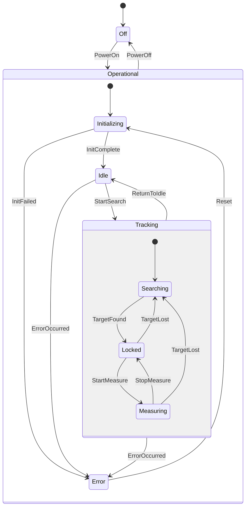
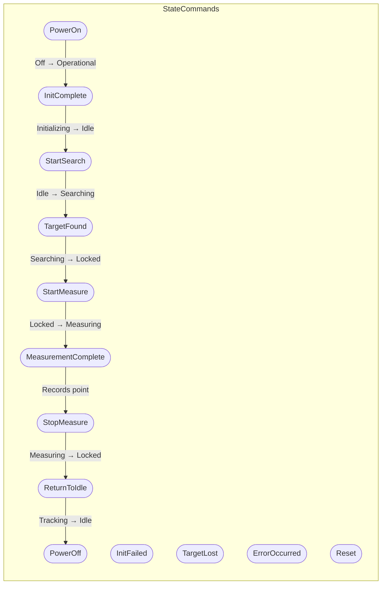
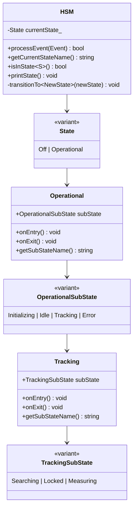

# Laser Tracker Threaded HSM - Hierarchical State Machine Demo

A C++17 implementation demonstrating the **Hierarchical State Machine (HSM)** pattern using `std::variant` for type-safe state representation. The HSM runs in a **dedicated worker thread**, providing **galvanic separation** between the main/UI thread and the state machine engine.

## Overview

This project showcases modern C++ patterns for implementing complex state machines with:

- **Hierarchical (nested) states** using `std::variant`
- **Type-safe command handling** with `std::visit`
- **State entry/exit actions** for resource management
- **Composite states** containing sub-states
- **Command-driven transitions** with proper action handling
- **Dedicated worker thread** for the HSM engine
- **Galvanic separation** between UI and worker threads
- **StateCommands** (commands that trigger state transitions)
- **ActionCommands** (commands that don't change state, may be state-restricted)
- **JSON message protocol** for inter-thread communication
- **Synchronous/asynchronous execution** with timeout support

## State Hierarchy

The Laser Tracker HSM implements a multi-level state hierarchy:



## Command Flow



## Architecture



## Threaded Architecture

The `ThreadedHSM` class provides complete galvanic separation between the UI/main thread and the HSM worker thread:

### Features

- **Dedicated Worker Thread**: HSM runs in its own thread ("LaserTracker HSM Worker"), processing messages from a queue
- **Thread-Safe State Access**: Query state safely from any thread
- **Message-Based Communication**: Events and commands sent via thread-safe queue
- **Synchronous & Asynchronous**: Choose blocking or fire-and-forget message sending
- **Timeout Support**: Configurable timeouts prevent indefinite blocking
- **Command Buffering**: Messages queued during sync operations
- **Debugger-Friendly**: Worker thread is named for easy identification in Visual Studio/debuggers

### Commands

Commands are actions that don't change state but are restricted to specific states:

| Command | Valid States | Sync | Description |
|---------|--------------|------|-------------|
| `Home` | Idle | Yes | Move to home position |
| `GetPosition` | Idle, Locked, Measuring | No | Get current position |
| `SetLaserPower` | Any Operational | No | Adjust laser power (0.0-1.0) |
| `Compensate` | Idle, Locked | Yes | Apply environmental compensation |
| `GetStatus` | Any | No | Get system status |
| `MoveRelative` | Idle, Locked | Yes | Relative movement by azimuth/elevation |

### JSON Message Protocol

Messages use a unified JSON format for both requests and responses:

**Request Format:**
```json
{
  "id": 1,
  "name": "Home",
  "params": { "speed": 100.0 },
  "sync": true,
  "timeoutMs": 5000
}
```

**Response Format:**
```json
{
  "id": 1,
  "success": true,
  "result": { "position": { "azimuth": 0.0, "elevation": 0.0 } },
  "error": null
}
```

### Usage Example

```cpp
#include "ThreadedHSM.hpp"
using namespace LaserTracker;

ThreadedHSM tracker;
tracker.start();

// Send async state command (fire and forget)
tracker.sendStateCommandAsync(StateCommands::PowerOn{});

// Send sync state command and wait for response
auto response = tracker.sendStateCommandSync(StateCommands::InitComplete{});

// Send action command and get result
auto result = tracker.sendActionCommand(Commands::Home{50.0});
if (result.success)
{
    std::cout << "Home complete: " << result.params.dump() << "\n";
}

tracker.stop();
```

## C++ Programming Patterns Used

### 1. Type-Safe State Representation with `std::variant`

```cpp
// Top-level state variant
using State = std::variant<States::Off, States::Operational>;

// Nested state variants for hierarchy
using OperationalSubState = std::variant<Initializing, Idle, Tracking, Error>;
using TrackingSubState = std::variant<Searching, Locked, Measuring>;
```

**Benefits:**
- Compile-time type safety
- No virtual function overhead
- Exhaustive pattern matching with `std::visit`

### 2. Command Dispatch with `std::visit`

```cpp
bool processCommand(const StateCommand& command)
{
    return std::visit(
        [this, &command](auto& state) -> bool
        {
            return this->handleCommand(state, command);
        },
        currentState_);
}
```

**Benefits:**
- Type-safe command routing
- Compiler enforces handling all state types
- Clean separation of concerns

### 3. State Entry/Exit Actions

```cpp
struct Idle
{
    static constexpr const char* name = "Idle";

    void onEntry() const
    {
        std::cout << "  [ENTRY] Idle: Ready for operation\n";
    }

    void onExit() const
    {
        std::cout << "  [EXIT] Idle: Activating systems\n";
    }
};
```

**Benefits:**
- Resource acquisition/release at state boundaries
- Clear lifecycle management
- Debuggable state transitions

### 4. Composite State Pattern

```cpp
struct Tracking
{
    TrackingSubState subState;

    void onEntry() const
    {
        std::cout << "  [ENTRY] Tracking\n";
        std::visit([](const auto& s) { s.onEntry(); }, subState);
    }

    void onExit() const
    {
        std::visit([](const auto& s) { s.onExit(); }, subState);
        std::cout << "  [EXIT] Tracking\n";
    }
};
```

**Benefits:**
- Encapsulates sub-state behavior
- Proper entry/exit ordering
- Hierarchical event handling

### 5. constexpr Static Members

```cpp
struct Searching
{
    static constexpr const char* name = "Searching";
    // ...
};
```

**Benefits:**
- Zero runtime overhead for state names
- Compile-time string constants
- Enables template metaprogramming

### 6. SFINAE/if constexpr for Type Dispatch

```cpp
return std::visit(
    [](const auto& s) -> std::string
    {
        using T = std::decay_t<decltype(s)>;
        if constexpr (std::is_same_v<T, Tracking>)
        {
            return std::string(s.name) + "::" + s.getSubStateName();
        }
        else
        {
            return s.name;
        }
    },
    subState);
```

**Benefits:**
- Compile-time type selection
- No runtime branching overhead
- Type-specific code paths

## Building the Project

### Requirements

- C++17 compatible compiler (GCC 7+, Clang 5+, MSVC 2017+)
- CMake 3.14+

### Build Instructions

```bash
# Create build directory
mkdir build && cd build

# Configure
cmake ..

# Build
cmake --build .

# Run
./bin/laser_tracker_hsm
```

### Alternative: Direct Compilation

```bash
g++ -std=c++17 -pthread -o laser_tracker_hsm main.cpp
```

## Usage

### Command Line Options

```bash
./laser_tracker_hsm --help          # Show help
./laser_tracker_hsm --all           # Run all demos
./laser_tracker_hsm --interactive   # Interactive mode
./laser_tracker_hsm                  # Show menu
```

### Interactive Mode Commands

**StateCommands (trigger state changes):**

| Command | Description |
|---------|-------------|
| `power_on` | Power on the laser tracker |
| `power_off` | Power off the laser tracker |
| `init_ok` | Signal initialization complete |
| `init_fail` | Signal initialization failed |
| `search` | Start searching for target |
| `found <dist>` | Target found at distance (mm) |
| `lost` | Target lost |
| `measure` | Start measuring |
| `point <x> <y> <z>` | Record a measurement point |
| `stop` | Stop measuring |
| `idle` | Return to idle state |
| `error <code>` | Simulate an error |
| `reset` | Reset from error state |

**ActionCommands (actions with results):**

| Command | Description |
|---------|-------------|
| `home [speed]` | Move to home position (Idle only) |
| `getpos` | Get current position |
| `power <0-1>` | Set laser power level |
| `compensate <temp> <pressure> <humidity>` | Apply environmental compensation |
| `status` | Get system status |
| `move <az> <el>` | Move relative by azimuth/elevation |

**Utilities:**

| Command | Description |
|---------|-------------|
| `state` | Print current state |
| `help` | Show help |
| `quit` | Exit interactive mode |

### Demo Scenarios

1. **Threaded HSM Basic Operation** - Async/sync command sending to worker thread
2. **ActionCommands with State Restrictions** - Command validation and execution
3. **Synchronous Command Buffering** - Message queuing during sync operations
4. **JSON Message Protocol** - Raw JSON message handling
5. **Multi-threaded Command Sending** - Multiple threads sending commands to HSM
6. **Complete Workflow** - Full laser tracker workflow through all states

## State Transition Table

| Current State | StateCommand | Next State |
|---------------|-------|------------|
| Off | PowerOn | Operational::Initializing |
| Operational::* | PowerOff | Off |
| Initializing | InitComplete | Idle |
| Initializing | InitFailed | Error |
| Idle | StartSearch | Tracking::Searching |
| Idle | ErrorOccurred | Error |
| Tracking::* | ReturnToIdle | Idle |
| Tracking::* | ErrorOccurred | Error |
| Searching | TargetFound | Locked |
| Locked | StartMeasure | Measuring |
| Locked | TargetLost | Searching |
| Measuring | MeasurementComplete | Measuring (internal) |
| Measuring | StopMeasure | Locked |
| Measuring | TargetLost | Searching |
| Error | Reset | Initializing |

## Project Structure

```
StateMachine/
├── CMakeLists.txt        # CMake build configuration
├── ThreadedHSM.hpp       # Complete HSM with threading, commands & JSON messaging
├── main.cpp              # Demo application
├── .clang-format         # Code formatting configuration
├── claude.md             # Claude Code guidelines
└── README.md             # This file
```

## Key Design Decisions

1. **Header-Only Implementation**: `ThreadedHSM.hpp` is header-only for easy integration
2. **Galvanic Separation**: Complete thread isolation between UI and HSM worker
3. **Value Semantics**: States are value types stored in variants, avoiding heap allocation
4. **Minimal Dependencies**: Uses C++ standard library plus [nlohmann/json](https://github.com/nlohmann/json) for JSON handling
5. **Compile-Time Safety**: Type errors are caught at compile time, not runtime
6. **Unified Messaging**: Events and commands use the same message infrastructure
7. **Industry-Standard JSON**: Uses nlohmann/json for robust JSON parsing and serialization

## References

- [nlohmann/json - GitHub](https://github.com/nlohmann/json)
- [std::variant - cppreference](https://en.cppreference.com/w/cpp/utility/variant)
- [std::visit - cppreference](https://en.cppreference.com/w/cpp/utility/variant/visit)
- [Hierarchical State Machines](https://en.wikipedia.org/wiki/UML_state_machine#Hierarchically_nested_states)

## License

This is a demonstration project for educational purposes.
