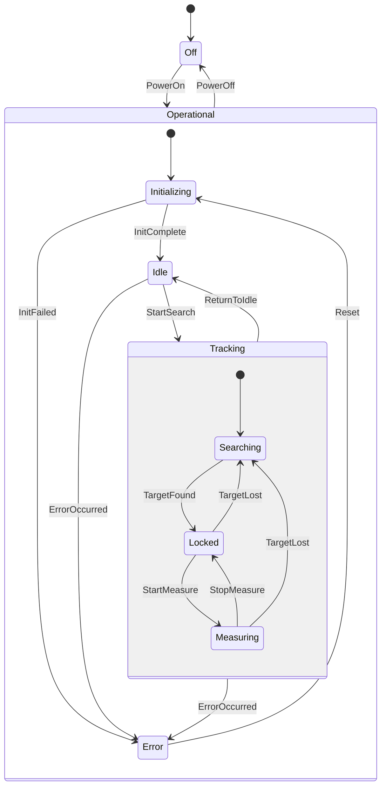
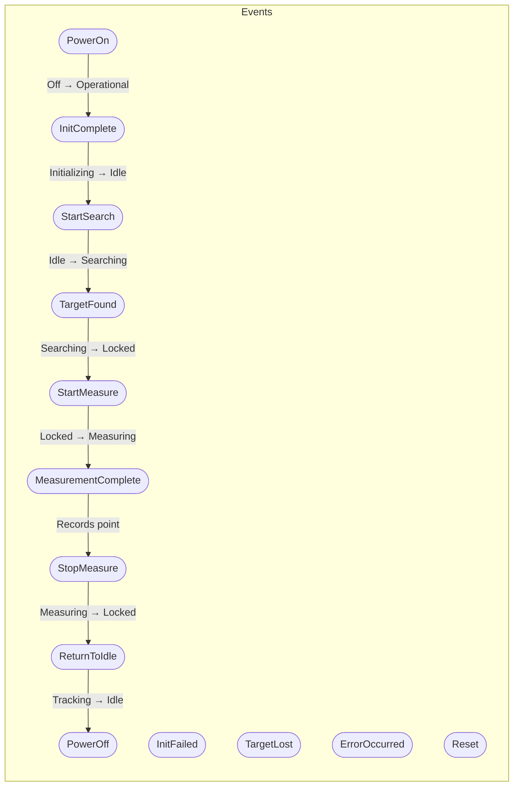
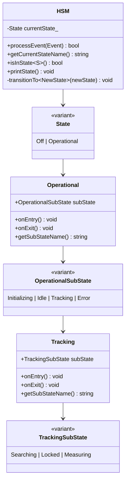

# Laser Tracker HSM - Hierarchical State Machine Demo

A C++17 implementation demonstrating the **Hierarchical State Machine (HSM)** pattern using `std::variant` for type-safe state representation.

## Overview

This project showcases modern C++ patterns for implementing complex state machines with:

- **Hierarchical (nested) states** using `std::variant`
- **Type-safe event handling** with `std::visit`
- **State entry/exit actions** for resource management
- **Composite states** containing sub-states
- **Event-driven transitions** with proper action handling

## State Hierarchy

The Laser Tracker HSM implements a multi-level state hierarchy:



## Event Flow



## Architecture



## C++ Programming Patterns Used

### 1. Type-Safe State Representation with `std::variant`

```cpp
// Top-level state variant
using State = std::variant<States::Off, States::Operational>;

// Nested state variants for hierarchy
using OperationalSubState = std::variant<Initializing, Idle, Tracking, Error>;
using TrackingSubState = std::variant<Searching, Locked, Measuring>;
```

**Benefits:**
- Compile-time type safety
- No virtual function overhead
- Exhaustive pattern matching with `std::visit`

### 2. Event Dispatch with `std::visit`

```cpp
bool processEvent(const Event& event) {
    return std::visit(
        [this, &event](auto& state) -> bool {
            return this->handleEvent(state, event);
        },
        currentState_);
}
```

**Benefits:**
- Type-safe event routing
- Compiler enforces handling all state types
- Clean separation of concerns

### 3. State Entry/Exit Actions

```cpp
struct Idle {
    static constexpr const char* name = "Idle";

    void onEntry() const {
        std::cout << "  [ENTRY] Idle: Ready for operation\n";
    }

    void onExit() const {
        std::cout << "  [EXIT] Idle: Activating systems\n";
    }
};
```

**Benefits:**
- Resource acquisition/release at state boundaries
- Clear lifecycle management
- Debuggable state transitions

### 4. Composite State Pattern

```cpp
struct Tracking {
    TrackingSubState subState;

    void onEntry() const {
        std::cout << "  [ENTRY] Tracking\n";
        std::visit([](const auto& s) { s.onEntry(); }, subState);
    }

    void onExit() const {
        std::visit([](const auto& s) { s.onExit(); }, subState);
        std::cout << "  [EXIT] Tracking\n";
    }
};
```

**Benefits:**
- Encapsulates sub-state behavior
- Proper entry/exit ordering
- Hierarchical event handling

### 5. constexpr Static Members

```cpp
struct Searching {
    static constexpr const char* name = "Searching";
    // ...
};
```

**Benefits:**
- Zero runtime overhead for state names
- Compile-time string constants
- Enables template metaprogramming

### 6. SFINAE/if constexpr for Type Dispatch

```cpp
return std::visit(
    [](const auto& s) -> std::string {
        using T = std::decay_t<decltype(s)>;
        if constexpr (std::is_same_v<T, Tracking>) {
            return std::string(s.name) + "::" + s.getSubStateName();
        } else {
            return s.name;
        }
    },
    subState);
```

**Benefits:**
- Compile-time type selection
- No runtime branching overhead
- Type-specific code paths

## Building the Project

### Requirements

- C++17 compatible compiler (GCC 7+, Clang 5+, MSVC 2017+)
- CMake 3.14+

### Build Instructions

```bash
# Create build directory
mkdir build && cd build

# Configure
cmake ..

# Build
cmake --build .

# Run
./bin/laser_tracker_hsm
```

### Alternative: Direct Compilation

```bash
g++ -std=c++17 -o laser_tracker_hsm main.cpp
```

## Usage

### Command Line Options

```bash
./laser_tracker_hsm --help          # Show help
./laser_tracker_hsm --all           # Run all demos
./laser_tracker_hsm --interactive   # Interactive mode
./laser_tracker_hsm                  # Show menu
```

### Interactive Mode Commands

| Command | Description |
|---------|-------------|
| `power_on` | Power on the laser tracker |
| `power_off` | Power off the laser tracker |
| `init_ok` | Signal initialization complete |
| `init_fail` | Signal initialization failed |
| `search` | Start searching for target |
| `found <dist>` | Target found at distance (mm) |
| `lost` | Target lost |
| `measure` | Start measuring |
| `point <x> <y> <z>` | Record a measurement point |
| `stop` | Stop measuring |
| `idle` | Return to idle state |
| `error <code>` | Simulate an error |
| `reset` | Reset from error state |
| `state` | Print current state |
| `help` | Show help |
| `quit` | Exit |

### Demo Scenarios

1. **Normal Operation Flow** - Happy-path workflow from power-on through measurement
2. **Error Handling and Recovery** - Initialization failures and error recovery
3. **Target Loss and Reacquisition** - Handling target loss during tracking
4. **Invalid Event Handling** - Demonstrating ignored events in wrong states
5. **State Inspection API** - Querying state machine state
6. **Comprehensive Stress Test** - Multiple complete cycles

## State Transition Table

| Current State | Event | Next State |
|---------------|-------|------------|
| Off | PowerOn | Operational::Initializing |
| Operational::* | PowerOff | Off |
| Initializing | InitComplete | Idle |
| Initializing | InitFailed | Error |
| Idle | StartSearch | Tracking::Searching |
| Idle | ErrorOccurred | Error |
| Tracking::* | ReturnToIdle | Idle |
| Tracking::* | ErrorOccurred | Error |
| Searching | TargetFound | Locked |
| Locked | StartMeasure | Measuring |
| Locked | TargetLost | Searching |
| Measuring | MeasurementComplete | Measuring (internal) |
| Measuring | StopMeasure | Locked |
| Measuring | TargetLost | Searching |
| Error | Reset | Initializing |

## Project Structure

```
StateMachine/
├── CMakeLists.txt        # CMake build configuration
├── LaserTrackerHSM.hpp   # HSM implementation (header-only)
├── main.cpp              # Demo application
├── .clang-format         # Code formatting configuration
└── README.md             # This file
```

## Key Design Decisions

1. **Header-Only HSM**: The entire state machine is in `LaserTrackerHSM.hpp` for easy integration
2. **Value Semantics**: States are value types stored in variants, avoiding heap allocation
3. **No External Dependencies**: Uses only C++ standard library
4. **Compile-Time Safety**: Type errors are caught at compile time, not runtime

## References

- [std::variant - cppreference](https://en.cppreference.com/w/cpp/utility/variant)
- [std::visit - cppreference](https://en.cppreference.com/w/cpp/utility/variant/visit)
- [Hierarchical State Machines](https://en.wikipedia.org/wiki/UML_state_machine#Hierarchically_nested_states)

## License

This is a demonstration project for educational purposes.
