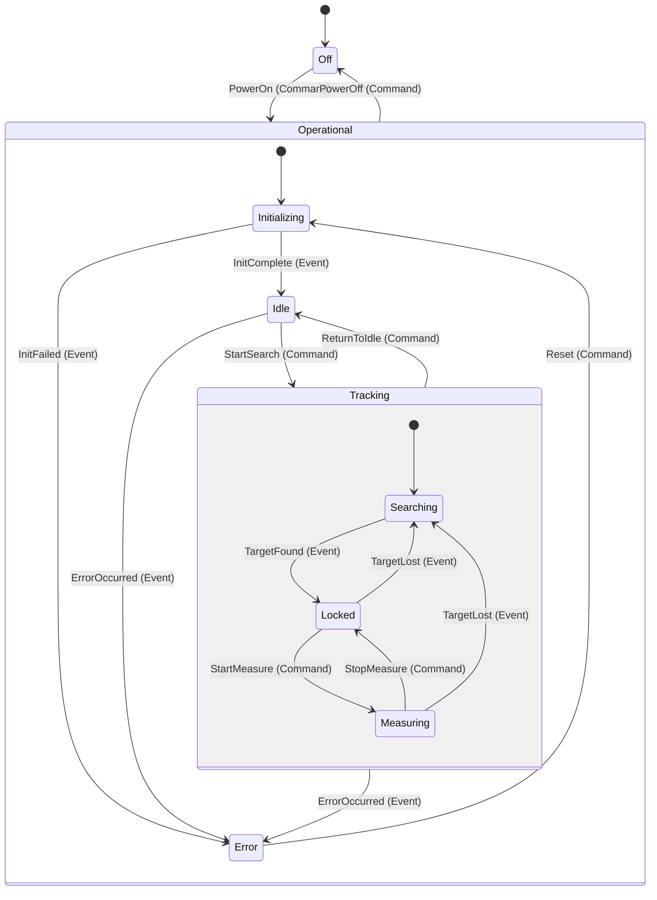
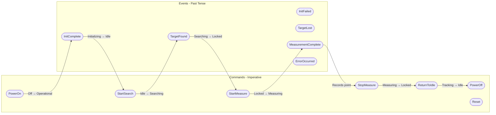
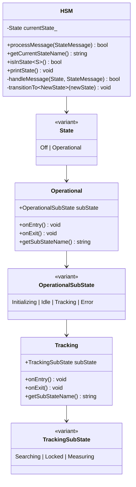

# Laser Tracker Threaded HSM - Hierarchical State Machine Demo

A C++17 implementation demonstrating the **Hierarchical State Machine (HSM)** pattern using `std::variant` for type-safe state representation. The HSM runs in a **dedicated worker thread**, providing **galvanic separation** between the main/UI thread and the state machine engine.

## Overview

This project showcases modern C++ patterns for implementing complex state machines with:

- **Hierarchical (nested) states** using `std::variant`
- **Type-safe event/command handling** with `std::visit`
- **State entry/exit actions** for resource management
- **Composite states** containing sub-states
- **Event-driven and command-driven transitions** with proper action handling
- **Dedicated worker thread** for the HSM engine
- **Galvanic separation** between UI and worker threads
- **Events** (past-tense notifications: "what happened")
- **Commands** (imperative instructions: "what to do")
- **JSON message protocol** for inter-thread communication
- **Synchronous/asynchronous execution** with timeout support

## Events vs Commands

The HSM distinguishes between two types of messages based on semantic meaning:

### Events (Past Tense - "What Happened")
Events represent external occurrences. The FSM doesn't control these; it simply reacts to them.

| Event | Parameters | Description |
|-------|------------|-------------|
| `InitComplete` | - | Initialization completed successfully |
| `InitFailed` | errorReason | Initialization failed with error |
| `TargetFound` | distance_mm | Target retroreflector was found |
| `TargetLost` | - | Target was lost during tracking |
| `MeasurementComplete` | x, y, z | A measurement point was recorded |
| `ErrorOccurred` | errorCode, description | An error occurred in the system |

### Commands (Imperative - "What to Do")
Commands are instructions sent to the FSM to drive specific outcomes.

**State-Changing Commands:**
| Command | Description |
|---------|-------------|
| `PowerOn` | Turn on the laser tracker |
| `PowerOff` | Turn off the laser tracker |
| `StartSearch` | Start searching for target |
| `StartMeasure` | Start precision measurement |
| `StopMeasure` | Stop measurement and return to locked |
| `Reset` | Reset the system from error state |
| `ReturnToIdle` | Return from tracking to idle state |

**Action Commands (don't change state, may be state-restricted):**
| Command | Valid States | Sync | Description |
|---------|--------------|------|-------------|
| `Home` | Idle | Yes | Move to home position |
| `GetPosition` | Idle, Locked, Measuring | No | Get current position |
| `SetLaserPower` | Any Operational | No | Adjust laser power (0.0-1.0) |
| `Compensate` | Idle, Locked | Yes | Apply environmental compensation |
| `GetStatus` | Any | No | Get system status |
| `MoveRelative` | Idle, Locked | Yes | Relative movement by azimuth/elevation |

## State Hierarchy

The Laser Tracker HSM implements a multi-level state hierarchy:



## Message Flow



## Architecture



## Threaded Architecture

The `ThreadedHSM` class provides complete galvanic separation between the UI/main thread and the HSM worker thread:

### Features

- **Dedicated Worker Thread**: HSM runs in its own thread ("LaserTracker HSM Worker"), processing messages from a queue
- **Thread-Safe State Access**: Query state safely from any thread
- **Message-Based Communication**: Events and commands sent via thread-safe queue
- **Synchronous & Asynchronous**: Choose blocking or fire-and-forget message sending
- **Timeout Support**: Configurable timeouts prevent indefinite blocking
- **Message Buffering**: Messages queued during sync operations
- **Debugger-Friendly**: Worker thread is named for easy identification in Visual Studio/debuggers

### JSON Message Protocol

Messages use a unified JSON format for both requests and responses:

**Request Format:**
```json
{
  "id": 1,
  "name": "Home",
  "params": { "speed": 100.0 },
  "sync": true,
  "timeoutMs": 5000
}
```

**Response Format:**
```json
{
  "id": 1,
  "success": true,
  "result": { "position": { "azimuth": 0.0, "elevation": 0.0 } },
  "error": null
}
```

### Usage Example

```cpp
#include "ThreadedHSM.hpp"
using namespace LaserTracker;

ThreadedHSM tracker;
tracker.start();

// Send message async (fire and forget)
tracker.sendMessageAsync(Commands::PowerOn{});

// Send message sync and wait for response
auto response = tracker.sendMessage(Events::InitComplete{});

// Same API for Commands and Events - unified interface
tracker.sendMessage(Commands::StartSearch{});
tracker.sendMessage(Events::TargetFound{5000.0});

// Action commands work the same way
auto result = tracker.sendMessage(Commands::Home{50.0});
if (result.success)
{
    std::cout << "Home complete: " << result.params.dump() << "\n";
}

tracker.stop();
```

The API is unified - `sendMessage()` and `sendMessageAsync()` work for both Events and Commands. The namespace distinction (`Events::` vs `Commands::`) provides semantic clarity while the processing is uniform.

## C++ Programming Patterns Used

### 1. Type-Safe State Representation with `std::variant`

```cpp
// Top-level state variant
using State = std::variant<States::Off, States::Operational>;

// Nested state variants for hierarchy
using OperationalSubState = std::variant<Initializing, Idle, Tracking, Error>;
using TrackingSubState = std::variant<Searching, Locked, Measuring>;
```

**Benefits:**
- Compile-time type safety
- No virtual function overhead
- Exhaustive pattern matching with `std::visit`

### 2. Unified Message Dispatch with `std::visit`

```cpp
// Single flat variant for all message types
using StateMessage = std::variant<
    Events::InitComplete, Events::TargetFound, ...
    Commands::PowerOn, Commands::StartSearch, ...
>;

// Unified processing - no if/else needed
bool processMessage(const StateMessage& msg)
{
    return std::visit(
        [this, &msg](auto& state) -> bool
        {
            return this->handleMessage(state, msg);
        },
        currentState_);
}

// Uniform name extraction via operator()
std::string getMessageName(const StateMessage& msg)
{
    return std::visit([](const auto& m) { return m(); }, msg);
}
```

**Benefits:**
- Type-safe message routing
- Compiler enforces handling all state types
- Uniform API for Events and Commands
- No if/else dispatch logic needed

### 3. State Entry/Exit Actions

```cpp
struct Idle
{
    static constexpr const char* name = "Idle";

    void onEntry() const
    {
        std::cout << "  [ENTRY] Idle: Ready for operation\n";
    }

    void onExit() const
    {
        std::cout << "  [EXIT] Idle: Activating systems\n";
    }
};
```

**Benefits:**
- Resource acquisition/release at state boundaries
- Clear lifecycle management
- Debuggable state transitions

### 4. Composite State Pattern

```cpp
struct Tracking
{
    TrackingSubState subState;

    void onEntry() const
    {
        std::cout << "  [ENTRY] Tracking\n";
        std::visit([](const auto& s) { s.onEntry(); }, subState);
    }

    void onExit() const
    {
        std::visit([](const auto& s) { s.onExit(); }, subState);
        std::cout << "  [EXIT] Tracking\n";
    }
};
```

**Benefits:**
- Encapsulates sub-state behavior
- Proper entry/exit ordering
- Hierarchical event handling

### 5. constexpr Static Members

```cpp
struct Searching
{
    static constexpr const char* name = "Searching";
    // ...
};
```

**Benefits:**
- Zero runtime overhead for state names
- Compile-time string constants
- Enables template metaprogramming

### 6. SFINAE/if constexpr for Type Dispatch

```cpp
return std::visit(
    [](const auto& s) -> std::string
    {
        using T = std::decay_t<decltype(s)>;
        if constexpr (std::is_same_v<T, Tracking>)
        {
            return std::string(s.name) + "::" + s.getSubStateName();
        }
        else
        {
            return s.name;
        }
    },
    subState);
```

**Benefits:**
- Compile-time type selection
- No runtime branching overhead
- Type-specific code paths

### 7. nlohmann/json ADL Serialization

Each Event and Command has `to_json`/`from_json` friend functions for automatic JSON conversion:

```cpp
struct TargetFound
{
    static constexpr const char* name = "TargetFound";
    double distance_mm = 0.0;

    friend void to_json(nlohmann::json& j, const TargetFound& e)
    {
        j = nlohmann::json{{"distance_mm", e.distance_mm}};
    }

    friend void from_json(const nlohmann::json& j, TargetFound& e)
    {
        if (j.contains("distance_mm"))
            j.at("distance_mm").get_to(e.distance_mm);
    }
};
```

**Benefits:**
- Automatic serialization via ADL (Argument-Dependent Lookup)
- Type-safe JSON conversion
- Consistent with nlohmann/json conventions

### 8. Compile-Time Type Registry with Fold Expressions

The `MessageRegistry` template maps JSON message names to C++ types at compile time:

```cpp
template <typename... Types>
struct MessageRegistry
{
    using Variant = std::variant<Types...>;

    // JSON name → variant: uses fold expression to find matching type
    static std::optional<Variant> fromJson(const std::string& name, const Json& params)
    {
        std::optional<Variant> result;
        (tryParseType<Types>(name, params, result) || ...);  // Fold expression
        return result;
    }

    // Same as fromJson, but excludes action commands (those with static `sync` member)
    static std::optional<Variant> fromJsonStateChanging(const std::string& name, const Json& params)
    {
        std::optional<Variant> result;
        (tryParseTypeExcludeActions<Types>(name, params, result) || ...);
        return result;
    }

    // variant → JSON: uses std::visit with to_json ADL
    static Json toJson(const Variant& msg)
    {
        return std::visit([](const auto& m) -> Json { return m; }, msg);
    }
};

// Single registry for all message types
using StateMessageRegistry = MessageRegistry<Events::..., Commands::...>;
```

**Benefits:**
- No manual if-else chains for JSON parsing
- Adding new message types is automatic (just include in variant)
- Compile-time type safety with runtime name lookup
- Action commands filtered using existing `has_sync` trait (no separate registry needed)
- `std::visit` handles dispatch after variant construction

### 9. Self-Executing Commands with execute() Member

Action commands have an `execute()` method that encapsulates their logic:

```cpp
struct Home
{
    static constexpr const char* name = "Home";
    static constexpr bool sync = true;
    double speed = 100.0;

    ExecuteResult execute(const std::string& currentState) const
    {
        if (currentState.find("Idle") == std::string::npos)
        {
            return ExecuteResult::fail("Home only valid in Idle state");
        }
        // ... perform homing ...
        return ExecuteResult::ok({{"position", {{"azimuth", 0.0}, {"elevation", 0.0}}}});
    }
};
```

The dispatcher uses `std::visit` to call the appropriate `execute()` method:

```cpp
Message processActionCommand(const Message& msg)
{
    auto actionCmd = StateMessageRegistry::fromJson(msg.name, msg.params);
    return std::visit(
        [&](const auto& cmd) -> Message
        {
            using T = std::decay_t<decltype(cmd)>;
            if constexpr (has_sync<T>::value)  // Action commands have sync member
            {
                ExecuteResult result = cmd.execute(currentState);
                return Message::createResponse(msg.id, result.success, result.params, result.error);
            }
            // ...
        },
        *actionCmd);
}
```

**Benefits:**
- Each command is self-contained (name, params, validation, execution logic)
- Adding a new command = implement one struct with `execute()`
- No if-else chains in dispatcher
- Type-safe dispatch via `std::visit`

## Building the Project

### Requirements

- C++17 compatible compiler (GCC 7+, Clang 5+, MSVC 2017+)
- CMake 3.14+

### Build Instructions

```bash
# Create build directory
mkdir build && cd build

# Configure
cmake ..

# Build
cmake --build .

# Run
./bin/laser_tracker_hsm
```

### Alternative: Direct Compilation

```bash
g++ -std=c++17 -pthread -o laser_tracker_hsm main.cpp
```

## Usage

### Command Line Options

```bash
./laser_tracker_hsm --help          # Show help
./laser_tracker_hsm --all           # Run all demos
./laser_tracker_hsm --interactive   # Interactive mode
./laser_tracker_hsm                  # Show menu
```

### Interactive Mode Commands

**Commands (Imperative - "What to Do"):**

| Command | Description |
|---------|-------------|
| `power_on` | Turn on the laser tracker |
| `power_off` | Turn off the laser tracker |
| `search` | Start searching for target |
| `measure` | Start measuring |
| `stop` | Stop measuring |
| `idle` | Return to idle state |
| `reset` | Reset from error state |
| `home [speed]` | Move to home position (Idle only) |
| `getpos` | Get current position |
| `power <0-1>` | Set laser power level |
| `compensate <temp> <pressure> <humidity>` | Apply environmental compensation |
| `status` | Get system status |
| `move <az> <el>` | Move relative by azimuth/elevation |

**Events (Past Tense - "What Happened"):**

| Command | Description |
|---------|-------------|
| `init_ok` | Initialization completed |
| `init_fail` | Initialization failed |
| `found <dist>` | Target was found at distance (mm) |
| `lost` | Target was lost |
| `point <x> <y> <z>` | Measurement point was recorded |
| `error <code>` | An error occurred |

**Utilities:**

| Command | Description |
|---------|-------------|
| `state` | Print current state |
| `help` | Show help |
| `quit` | Exit interactive mode |

### Demo Scenarios

1. **Threaded HSM Basic Operation** - Async/sync command and event sending to worker thread
2. **Commands with State Restrictions** - Command validation and execution
3. **Synchronous Command Buffering** - Message queuing during sync operations
4. **JSON Message Protocol** - Raw JSON message handling
5. **Multi-threaded Event Sending** - Multiple threads sending events to HSM
6. **Complete Workflow** - Full laser tracker workflow through all states

## State Transition Table

| Current State | Message | Type | Next State |
|---------------|---------|------|------------|
| Off | PowerOn | Command | Operational::Initializing |
| Operational::* | PowerOff | Command | Off |
| Initializing | InitComplete | Event | Idle |
| Initializing | InitFailed | Event | Error |
| Idle | StartSearch | Command | Tracking::Searching |
| Idle | ErrorOccurred | Event | Error |
| Tracking::* | ReturnToIdle | Command | Idle |
| Tracking::* | ErrorOccurred | Event | Error |
| Searching | TargetFound | Event | Locked |
| Locked | StartMeasure | Command | Measuring |
| Locked | TargetLost | Event | Searching |
| Measuring | MeasurementComplete | Event | Measuring (internal) |
| Measuring | StopMeasure | Command | Locked |
| Measuring | TargetLost | Event | Searching |
| Error | Reset | Command | Initializing |

## Project Structure

```
StateMachine/
├── CMakeLists.txt        # CMake build configuration
├── Keywords.hpp          # Compile-time string constants for JSON keys
├── ThreadedHSM.hpp       # Complete HSM with threading, events/commands & JSON messaging
├── main.cpp              # Demo application
├── tests/
│   ├── test_hsm.cpp           # HSM state transition tests
│   ├── test_threaded_hsm.cpp  # Threading and message passing tests
│   └── test_action_commands.cpp # Action command tests
├── .clang-format         # Code formatting configuration
├── CLAUDE.md             # Claude Code guidelines (includes README maintenance rules)
└── README.md             # This file (keep in sync with code!)
```

## Key Design Decisions

1. **Header-Only Implementation**: `ThreadedHSM.hpp` is header-only for easy integration
2. **Galvanic Separation**: Complete thread isolation between UI and HSM worker
3. **Value Semantics**: States are value types stored in variants, avoiding heap allocation
4. **Minimal Dependencies**: Uses C++ standard library plus [nlohmann/json](https://github.com/nlohmann/json) for JSON handling
5. **Compile-Time Safety**: Type errors are caught at compile time, not runtime
6. **Semantic Messaging**: Events (past tense) and Commands (imperative) in separate namespaces for clear intent
7. **Flat Variant Design**: Single `StateMessage` variant contains all types directly - no nested variants, no if/else dispatch
8. **Uniform API**: `sendMessage()` works for both Events and Commands - namespace distinction provides semantics, processing is uniform
9. **Industry-Standard JSON**: Uses nlohmann/json for robust JSON parsing and serialization
10. **Type Registry Pattern**: Single `MessageRegistry` template eliminates manual if-else chains for JSON↔variant conversion using fold expressions; action commands filtered via `has_sync` trait
11. **ADL Serialization**: Each message type has `to_json`/`from_json` friend functions for automatic nlohmann/json integration
12. **Self-Executing Commands**: Action commands have an `execute()` method - the command struct contains all logic (validation, execution, result). Dispatcher uses `std::visit` to call it.
13. **Compile-Time String Constants**: All JSON keys defined in `Keywords.hpp` as `inline constexpr` (position, state, command params, event params, results, message protocol) - no runtime string allocation, single point of definition, type-safe refactoring.

## References

- [nlohmann/json - GitHub](https://github.com/nlohmann/json)
- [std::variant - cppreference](https://en.cppreference.com/w/cpp/utility/variant)
- [std::visit - cppreference](https://en.cppreference.com/w/cpp/utility/variant/visit)
- [Hierarchical State Machines](https://en.wikipedia.org/wiki/UML_state_machine#Hierarchically_nested_states)

## License

This is a demonstration project for educational purposes.
